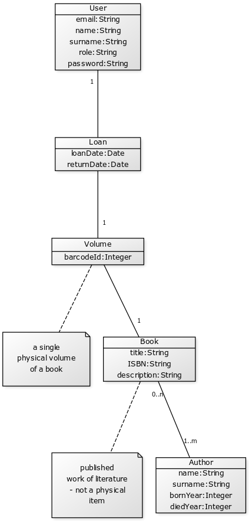

Application architecture
========================
The application consists of two separate microservice modules:
- core - provides library management service that uses a database to store data. It is accesed through REST API.
- web - web frontend written in React.js that uses core

Data model
----------


REST API
--------
REST API exposes an endpoint for each entity in the data model with standard CRUD operations. The API is available under `/rest` endpoint, i.e. `/rest/books/1`.

Authentication
--------------
The application by default uses HTTP basic authentication for secured endpoints.
The database is initialized with a single administrator account with email
`admin@example.com` and password `1234`.

Roles
-----
Application contains these roles:
- `admin` - has permissions to do everything
- `checkout` - employee at the checkout counter, has permissions to manage book loans (loan books, return books) and users (register new users)
- `user` - can only search and list books and authors and views it's own loan history. Doesn't have acces to loans of other users, but can see whether a book is lent or not.
- unauthenticated user - can access the same as `user` role, but doesn't have it's own profile with loan history.

Deployment
==========
Run wildfly in standalone-full-ha mode. For clustering it might be necessary
to add an option to use IPv4 stack.

```
JAVA_OPTS='-Djava.net.preferIPv4Stack=true' bin/standalone.sh -c standalone-full-ha.xml
```

Configuration
-------------
The project needs to define its security domain. For that it ships
a configuration script `core/install.cli`. It can be run using jboss-cli or via
maven using `mvn wildfly:execute-commands` from the core directory.

Backend
-------
Backend war can be deployed using maven by running `mvn wildfly:deploy` from
core directory.
To deploy without default H2 datasource, use `no-ds` maven profile (`mvn -Pno-ds wildfly:deploy`).

Frontend
--------
Frontend war can be deployed using maven by running `mvn wildfly:deploy` from
web directory.
